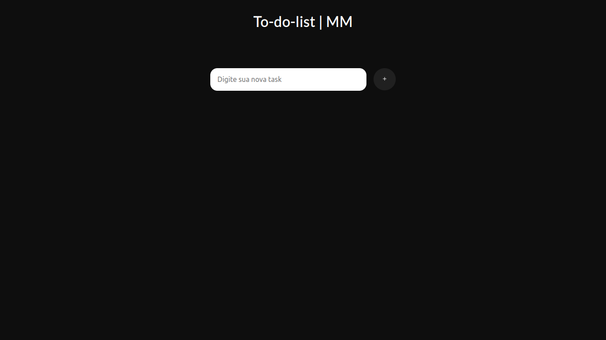

<h1 align="center">To_do_list-MM
List Generator in Development, Local Storage
</h1> 

For each task placed in the input and confirmed with the button, a new list will be applied to the screen and saved in local storage
 

<h4 align="center"> 
	🚧 Projeto 🚀 Em construção...  🚧
</h4>

<h1 align="center">
Technology used
</h1>

  

Em javaScript há quatro funções ValidateIfExistsTask(),newTask(),showValues() e removeItem(data).
 

Basicamente existe a validação da lista colocada no input, a validação de novas task e a ação de remover a task da lista!

